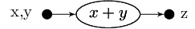

Tutorial 1 {#tutorial1}
========
[TOC]

In this tutorial we will be introducing the basics of the Hybrid Task Graph Scheduler (HTGS) API.

The [Source Code]() can be viewed in the HTGS-Tutorials github repository. 

We will be implementing a simple add function to add two numbers and
 return the result, which introduces the API and how to work with it.

Objectives {#objectives}
=======

1. How to represent data: (input and output)
  - How to customize the priority of data (optional)

2. How to operate on data with an ITask
3. How to add an ITask to a TaskGraph
4. How to add data into a TaskGraph
5. How to process data from a TaskGraph

API Used {#api-used}
======

- \<htgs/api/IData.hpp\>
- \<htgs/api/ITask.hpp\>
- \<htgs/api/TaskGraphConf.hpp\>
- \<htgs/api/TaskGraphRuntime.hpp\>

Implementation {#implementation}
======

Below we will go into detail on each of the components needed to implement the algorithm x+y=z. Before we
implement any code, we must analyze the algorithm and transform it into a
dataflow graph. The dataflow graph provides a high level view of the algorithm such as
data dependencies, control flow, and compute instances.

Algorithm: \f$x+y=z\f$

Dataflow graph:

TaskGraph:

We transform the dataflow graph into a TaskGraph. We have two input
types for the x+y operation, so we will compose the inputs into a single object
to hold both x and y data. The result of the graph is a single value, so another
data object is used to hold the ouput. There will be one compute task, which is
responsible for the operation x+y.

## Data {#data}
The algorithm we are implementing adds two numbers and returns a result. One data class will be responsible for
passing the two numbers to the Task and another data class will store the output. **Data is defined by inheriting the IData
interface.**

When data is passed from Task to Task it is inserted into a [Connector](@ref htgs::Connector), which uses
a FIFO queue to hold data (transformed into a priority queue using the USE_PRIORITY_QUEUE directive)

If a Task expects multiple input values, then IData acts as a container where each of those input values is a single object.

All data in HTGS is represented as [IData](@ref htgs::IData). IData is an interface and contains only one (optional)
 virtual function: [IData::compare](@ref htgs::IData::compare). Compare can be used to customize
 the ordering of data in the Connector's queue. **Priority is enabled only if the USE_PRIORITY_QUEUE directive is defined.**

### Input data implementation {#input-data}

~~~~{.c}
#include <htgs/api/IData.hpp>

class InputData : public htgs::IData
{
 public:
  InputData(int x, int y) : x(x), y(y) {}

  int getX() const { return x; }
  int getY() const { return y; }

 private:
  int x;
  int y;

};

~~~~

### Output data implementation {#output-data}

~~~~~~~~~~~~~~~~~{.c}
#include <htgs/api/IData.hpp>

class OutputData : public htgs::IData
{
public:
  OutputData(int result) : IData(result),  result(result) {}

  int getResult() const { return result; }

 private:
  int result;
};
~~~~~~~~~~~~~~~~~

### Notes {#data-notes}

- IData can contain multiple input data being sent to an ITask
- Assuming USE_PRIORITY_QUEUE directive is defined
    + Uses order constructor for IData, which will provide an ordering based on the lowest value first.
    + The ordering can be customized if the [IData::compare](@ref htgs::IData::compare) function is overriden

Example altering the order of data to highest value first (USE_PRIORITY_QUEUE directive to enable priority):
~~~~~~~~~~~~{.c}
bool compare(const std::shared_ptr<OutputData> p2) const {
    // getOrder() is inherited from the htgs::IData class
    return this->getOrder() < p2->getOrder();
}
~~~~~~~~~~~~

## Tasks {#tasks}

To implement the add function of the algorithm, we will only be needing one Task. **A Task is
defined by inheriting the ITask interface.**

Data is sent to/from an ITask through a TaskScheduler. The TaskScheduler manages
the ITask's input/output Connectors. The input is passed to the [ITask::executeTask](@ref htgs::ITask::executeTask) function.
The output is processed by calling the [ITask::addResult](@ref htgs::ITask::addResult) function from
within the executeTask function.

The TaskScheduler is setup when adding an ITask to a TaskGraph.
Multi-threading for an ITask is defined by the constructor for the ITask. Other options such as polling for data or
initiating execution without data is also within various constructors for the ITask. These features
are demonstrated in the next tutorial.

The ordering of the data entering/leaving an ITask can be customized using the USE_PRIORITY_QUEUE directive and by
defining the priority of IData through its compare function or order constructor.

Every ITask has an input type and and output type.
These types are defined by the first and second template parameters, respectively.

There are 5 mandatory functions that every ITask must implement:

1) [ITask::initialize(pipelineId, ...)](@ref htgs::ITask::initialize)
        - Called immediately when the thread that is bound to its TaskScheduler begins executing. Two variations available.
        One for simple initialization and other to aid in more advanced components such as work stealing. The basic
        usage of the initialize is to allocate local memory to be used by an ITask. This memory should be freed in
        the shutdown function. If the ITask is in an [ExecutionPipeline](htgs::ExecutionPipeline), then the pipelineId indicate which
       pipeline the Task belongs to. This will be shown and used in a future tutorial.

2) [ITask::shutdown()](@ref htgs::ITask::shutdown)
        - Called when the ITask::isTerminated function returns true. At this point the thread bound
    to the Task is about to terminate. Often used to deallocate local ITask memory.

3) [ITask::executeTask(data)](@ref htgs::ITask::executeTask)
        - Function to process input data. Using the [ITask::addResult](@ref htgs::ITask::addResult) function,
     output data is sent to the next connected Task.

4) [ITask::copy()](@ref htgs::ITask::copy)
        - Creates a copy of the ITask. Called during the [Runtime](@ref htgs::Runtime) when a Task is being copied
        and bound to a thread. This function is used for concurrency/multithreading.
        If data is shared among ITask's that are copied, then proper synchronization may be required to manage that data.

5) [ITask::isTerminated(inputConnector)](@ref htgs::ITask::isTerminated)
        - Determines if the Task is ready to be terminated. In most cases, the ITask should use
    the input htgs::Connector, which is passed as a parameter to isTerminated.
    The [Connector::isInputTerminated](@ref htgs::Connector::isInputTerminated)
    function can be used by the ITask to check if all producers for the connector have finished sending data
    and the data queue is empty.

The interaction between the ITask, TaskScheduler, and TaskScheduler's thread is shown below:

### AddTask Implementation {#addtask-implementation}

~~~~~~~~~~{.c}

#include "../data/InputData.h"
#include "../data/OutputData.h"

#include <htgs/api/ITask.hpp>

class AddTask : public htgs::ITask<InputData, OutputData>
{
public:
    virtual void initialize(int pipelineId, int numPipelines) { }
    virtual void shutdown() { }
    virtual void executeTask(std::shared_ptr<InputData> data) {
        // Adds x + y
        int sum = data->getX() + data->getY();

        // Sends data along output edge
        this->addResult(new OutputData(sum));
    }
    virtual AddTask *copy() {
        return new AddTask();
    }
    virtual bool isTerminated(std::shared_ptr<htgs::BaseConnector> inputConnector) {
        return inputConnector->isInputTerminated();
    }
};
~~~~~~~~~~

### Notes {#task-notes}

- The input and output types of the ITask are defined by the first and second template parameters, respectively.
- Memory leaks are avoided by using the C++11 std::shared_ptr class. When adding data with addResult,
the memory pointer allocated will be automatically wrapped into a shared_ptr to ensure it gets
freed once all references have finished referring to it.
- There are two variations of the initialize function. In most cases the basic version should be only be used

## Creating and Executing a TaskGraph {#create-and-execute-taskgraph}

The TaskGraph is used to connect Tasks with their TaskSchedulers and connect the TaskSchedulers together
using Connectors.

There are five functions available to connect an ITask to another ITask in a TaskGraph.

1) [TaskGraph::addGraphInputConsumer(iTask)](@ref htgs::TaskGraph::addGraphInputConsumer)
    + Sets the iTask to be the consumer of input that enters the TaskGraph (The input type of the TaskGraph, must match the input type of the Task)

2) [TaskGraph::addGraphOutputProducer(iTask)](@ref htgs::TaskGraph::addGraphOutputProducer)
    + Sets the iTask to be the producer of output that leaves the TaskGraph
    (the output type of the TaskGraph, must match the output type of the Task)

3) [TaskGraph::addEdge(iTaskProducer, iTaskConsumer)](@ref htgs::TaskGraph::addEdge)
    + Connects two Task's together (The output type of the producer, must match the input type of the consumer)

4) [TaskGraph::addRule(bookkeeper, iTaskConsumer, iRule)](@ref htgs::TaskGraph::addRule)
    + Adds a rule to a bookkeeper for sending data to a consumer (demonstrated in a future tutorial)

5) [TaskGraph::addCustomEdge(iCustomEdge)](@ref htgs::TaskGraph::addCustomEdge)
    + Creates a customized connection between a producer and consumer (demonstrated in a future tutorial)

Every TaskGraph has an input type and output type to allow sending/receiving data to/from a TaskGraph.
In this tutorial we will be demonstrating this functionality.

There are three steps necessary for adding data to a graph and ensuring the graph will finish executing.

1. Specify the ITask that will be processing the input data with [TaskGraph::addGraphInputConsumer](@ref htgs::TaskGraph::addGraphInputConsumer)
2. Increment the number of producers with [TaskGraph::incrementGraphInputProducer](@ref htgs::TaskGraph::incrementGraphInputProducer)
3. When there is no more data to be produced: [TaskGraph::finishedProducingData](@ref htgs::TaskGraph::finishedProducingData)

If [TaskGraph::incrementGraphInputProducer](@ref htgs::TaskGraph::incrementGraphInputProducer) is specified and
 [TaskGraph::finishedProducingData](@ref htgs::TaskGraph::finishedProducingData) is never called, then the TaskGraph
 will not finish executing.

 To process the output of a TaskGraph use the [TaskGraph::consumeData](@ref htgs::TaskGraph::consumeData) function. To
 determine if there is no more data being produced by the TaskGraph, use the
 [TaskGraph::isOutputTerminated](@ref htgs::TaskGraph::isOutputTerminated) function.

To execute a TaskGraph, the TaskGraph is managed by the [Runtime](@ref htgs::Runtime). The
Runtime will create threads, which are bound to TaskSchedulers. If a Task has more than
one thread specified, then the Runtime will duplicate the Task such that each thread will be responsible
for a separate instance of the Task.

If there are complications when running a TaskGraph, the TaskGraph can be saved as a dot
 file with the function [TaskGraph::writeDotToFile](@ref htgs::TaskGraph::writeDotToFile), which can be visually shown
 with the following command 'dot -Tpng \<filename\> -o \<filename\>.png'.
 The dot command is provided in the [GraphViz software](http://www.graphviz.org/). Below is an example dot file that is
 generated and the associated image representation:

 Dot file generated using "taskGraph->writeDotToFile("tutorial1.dot")":
 ~~~~~
digraph {
node[shape=record, fontsize=10, fontname="Verdana"];
edge[fontsize=10, fontname="Verdana"];
graph [compound=true];
x10f6380 -> x10f6010;
x10f6380[label="",shape=box,style=filled,color=black,width=.2,height=.2];
x10f6010 -> x10f6720;
x10f6720[label="",shape=box,style=filled,color=black,width=.2,height=.2];
x10f6010[label="x+y=z"];
}
 ~~~~~

 And the image generated with GraphViz using "dot -Tpng tutorial1.dot -o tutorial1.png"

### Main function (create and execute TaskGraph) {#main-function}

~~~~~~~~~~{.c}
#include <htgs/api/TaskGraph.hpp>
#include <htgs/api/Runtime.hpp>
#include "tasks/AddTask.h"

int main() {

    // Creates the Task
    AddTask *addTask = new AddTask();

    // Creates the TaskGraph
    auto taskGraph = new htgs::TaskGraph<InputData, OutputData>();

    // Declares that AddTask will be processing the input of a TaskGraph
    taskGraph->addGraphInputConsumer(addTask);

    // Declares that AddTask will be producing data for the output of a TaskGraph
    taskGraph->addGraphOutputProducer(addTask);

    // Increments the number of producers (the main thread will be producing data)
    taskGraph->incrementGraphInputProducer();

    // Launch the taskGraph
    auto runtime = new htgs::Runtime(taskGraph);

    runtime->executeRuntime();

    int numData = 10;

    // Main thread producing data
    for (int i = 0; i < numData; i++)
    {
        auto inputData = new InputData(i, i);
        taskGraph->produceData(inputData);
    }

    // Indicate that the main thread has finished producing data
    taskGraph->finishedProducingData();

    // Wait until the runtime has finished processing data
    runtime->waitForRuntime();

    // Process the ouput of the TaskGraph until no more data is available
    while (!taskGraph->isOutputTerminated())
    {
        auto data = taskGraph->consumeData();

        int result = data->getResult();

        std::cout << "Result: " << result << std::endl;
    }

    // Release all memory for the graph
    delete runtime;
}
~~~~~~~~~~

Sample execution:
~~~~
./tutorial1
Result: 0
Result: 2
Result: 4
Result: 6
Result: 8
Result: 10
Result: 12
Result: 14
Result: 16
Result: 18
~~~~

### Notes {#taskgraph-notes}

- The input and output types for each Task being added must match based on the way they are being added
into a TaskGraph
    + Example 1: addEdge types match based on output of producer and input of consumer
    + Example 2: addGraphInputConsumer types match based on input of graph and input on consumer
- To release all memory for HTGS, you only need to delete the runtime.
- Threading is managed by the runtime, which will spawn threads and join on them.
- If the main thread or some other component is producing data for a TaskGraph:
    1. Specify the ITask that will be processing the input data with [TaskGraph::addGraphInputConsumer](@ref htgs::TaskGraph::addGraphInputConsumer)
    2. Increment the number of producers with [TaskGraph::incrementGraphInputProducer](@ref htgs::TaskGraph::incrementGraphInputProducer)
    3. When there is no more data to be produced: [TaskGraph::finishedProducingData](@ref htgs::TaskGraph::finishedProducingData)
- Use the [TaskGraph::consumeData](@ref htgs::TaskGraph::consumeData) function to retrieve the output from a TaskGraph.
- Use the [TaskGraph::isOutputTerminated](@ref htgs::TaskGraph::isOutputTerminated) function to check if the TaskGraph has
finished producing data.

Summary {#summary}
======

In this tutorial, we looked at the basics of the HTGS API.
- Data using IData
- Compute Functions using the ITask interface
- Creating a TaskGraph
- Executing a TaskGraph
- Sending data into a TaskGraph
- Processing data produced by a TaskGraph

In the next tutorial, we will introduce two operations that assist in representing algorithms that contain
dependencies and strict memory limitations: (1) Bookkeeper and (2) MemoryManager.

Additional information:
- Header files that begin the 'I' denote interfaces; examples: [IData](@ref htgs::IData) and [ITask](@ref htgs::ITask)
- An ITask is managed by a TaskScheduler which works with Task's input and output Connectors, and calls the
underlying ITask API.
- Tasks are connected through [Connectors](@ref htgs::Connector), which are setup when adding an ITask to a [TaskGraph](@ref htgs::TaskGraph).
- When transforming an algorithm into a TaskGraph, it helps to create a dataflow representation first to aid in understanding
data dependencies. This is particularly useful when setting up IData and as will be seen in the next tutorial Bookkeeper rules and MemoryManagers.
