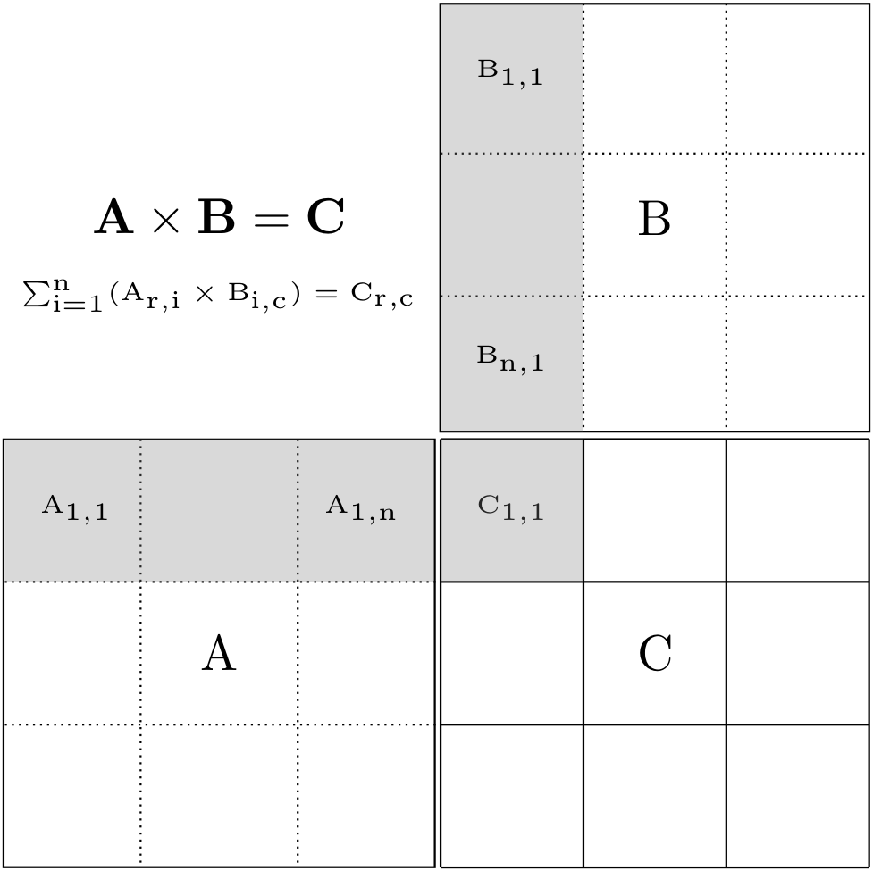
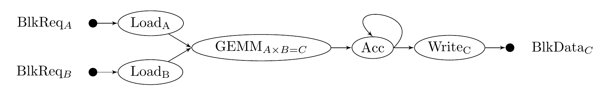

Tutorial 3A {#tutorial3a}
========
[TOC]

In this tutorial we implement the matrix multiplication algorithm and how to represent it using HTGS. Matrix
multiplication provides interesting challenges in decomposition of data and managing their dependencies. 
Parts A and B of this tutorial assume the data is pre-loaded into memory. Part C will incorporate memory mapped files, 
loading the matrices from disk, and a third variant is available [here](Link to third version), which stores matrix blocks as files.

Objectives {#tut3a-objectives}
=======
1. How to represent complex dependencies using a htgs::IRule
2. How to represent a cycle in the graph and defining a termination condition
3. How to represent a barrier for a reduction
  - In this case the reduction is accumulating the result matrix from matrix multiplication
4. How thread configurations for tasks impact performance

API Used {#tut3a-api-used}
======

- \<htgs/api/IData.hpp\>
- \<htgs/api/ITask.hpp\>
- \<htgs/api/TaskGraphConf.hpp\>
- \<htgs/api/TaskGraphRuntime.hpp\>
- \<htgs/api/Bookkeeper.hpp\>
- \<htgs/api/IRule.hpp\>

Implementation {#tut3a-implementation}
======

Before implementing any code with the HTGS API, the first step is to analyze the algorithm and identify ways to 
represent data to exploit parallelism.

Matrix multiplication is defined as multiplying two matrix \f$A^{m,n} \times B^{n,p} = C^{m,p}\f$,
which  is computed as a the dot product for each row of A and a column of B, as shown in the pseudo code below.

~~~~
Given matrices A and B, where the width of A is the same as the height of B

void GEMM(A, B, C)
{
  for_each(i : row of A) {
    for_each(j : column of B) {
      double sum = C[i][j];
      for_each(k : column of A) {
          sum = sum + A[i][k] * B[k][j];
      }
      C[i][j] = sum;
    }
  }
}
~~~~

Similar to the Hadamard product from the last tutorial, one possible decomposition strategy is to represent the full matrix into smaller block-sized pieces, as shown below.

This decomposition is represented in the pseudo code below:
~~~~
void block-gemm(A, B, C, blksize)
{
  b = blksize

  for(I : M in steps of b) { 
    for(J : P in steps of b) {
      for (K : N in steps of b) {
        // Select ranges within matrices A, B, and C
        GEMM(A(I:I+b,K:K+b),
             B(K:K+b,J:J+b),
             C(I:I+b,J:J+b));
      }
    }
  }
}
~~~~

Two challenges with parallelizing matrix multiplication are: (1) representing its two dependencies and (2) managing memory. 

The two dependencies are:
1. A block of matrix A at column i, must be multiplied by all blocks of matrix B at row i
  + Or a block of matrix B at row i must be multiplied by all blocks of matrix A at column i 
2. N sub-results of C must be accumulated
  + Each block multiplication between A and B produces a sub-result of C

Assuming these dependencies are defined such that they can process data correctly in any order, then the entire computation can be processed asynchronously.

For tutorial 3, we assume that the matrices will fit into system memory, so no memory management will be used. In
tutorial 4, we augment the graph from this tutorial to incorporate the GPU with GPU-based memory edges. 

Given the block decomposition of the algorithm, we transform the matrix multiplication into a dataflow graph and then into a task graph, shown below. In this implementation of matrix multiplication, we separate each block-based
matrix multiplication into its own task, which feeds into an accumulate task that is responsible for summing
the results until the result matrix is fully processed. This separation allows for the matrix multiplication
to be embarrassingly parallel, at the expensive of using more memory to store multiple sub-results of the result matrix.

 

Starting from the left,  the task graph representation begins with a htgs::Bookkeeper, which is used to distribute
data between the LoadA and LoadB tasks. The graph starts with a htgs::Bookkeeper because
the htgs::TaskGraphConf can only have a single task processing data coming into the graph. The htgs::Bookkeepers
operates on data extremely rapidly, so the overhead of handling all the data and distributing it is minimal.
Using this htgs::Bookkeeper and two htgs:IRules, a matrix request is sent to the appropriate load task based on the request's matrix type.
Next, matrices A and B are loaded asynchronously and sent to the second htgs::Bookkeeper.

The second htgs::Bookkeeper uses a htgs::IRule that processes the loaded matrices for A and B and identifies when one or more pairs
of matrices are ready to be processed with the matrix multiplication (GEMM) task. The GEMM task computes the
matrix multiplication between matrices A and B, and produces a sub-result of matrix C for the third htgs::Bookkeeper.

The third htgs::Bookkeeper gathers sub-results for matrix C and uses two htgs::IRules. The first htgs::IRule 
sends two of the sub-result matrices that have a matching row,column to the accumulate (Acc) task. 
The second htgs::IRule identifies when a block of matrix C has been fully accumulated and is ready for post-processing.

The accumulate (Acc) task accumulates two sub-results of matrix C into a single sub-result, which is returned to the
third htgs::Bookkeeper for further accumulation or post-processing.

The WriteC task is responsible for outputting the final sub-result. In this case, it is copying the block of the
matrix to a larger piece of memory to be used by the main thread. This task could be representative of additional
processing within a larger algorithm that is working at a block-based granularity.

In the next sections, we implement each of the components for the htgs::TaskGraphConf.

## Data {#tut3a-data}

This tutorial uses the same data as presented in [Tutorial 2A Data](@ref tut2a-data).

## Tasks {#tut3a-tasks}

From the tasks laid out in the above dataflow and task graphs, we define a htgs::ITask for the 
load, matrix multiplication (GEMM), accumulate, and write tasks. As mentioned above, we assume all 
matrices will fit into main memory, and the result matrix has been initialized to zeros.

The [LoadMatrixTask](@ref tut3a-load-matrix-task) receives a pointer to a matrix from the main thread and the type (either matrix A or B). In
the execute phase of the task, a request is received, which determines the sub-region of the matrix based on the
block size. The purpose of this task is to create a pointer to the starting position of the block for a matrix at
a given row,column block request. This pointer is sent to the next task with the necessary width, height, and leading
dimension size of the block. 

The [MatMulBlkTask](@ref tut3a-matmul-task) receives MatrixBlockMulData. We use
the [computeMatMul](@ref LinkToFunction) function to process the matrix multiplication of two of the matrices from
the input data. The sub-result is stored
in a piece of memory that is dynamically allocated within the execute function, which is then send along the output
edge using htgs::ITask::addResult.

The [MatMulAccumTask](@ref tut3a-matmul-accum-task) receives MatrixBlockMulData to accumulate two of the matrices. One of the matrices is overwritten
and sent as output for this task. The other matrix has its memory released.

The [MatMulOutputTask](@ref tut3a-matmul-output-task) receives MatrixBlockData, which represents the final result for a block of the result matrix.
The constructor for this task receives a pointer to a matrix that is used to store the final 
resulting matrix. The purpose of this task is to copy the block matrix into the larger matrix, which
is used by the main thread to simplify validating that the result is correct. The task sends MAtrixRequestData
along its output edge to indicate which row,column block has been processed.

### LoadMatrixTask {#tut3a-load-matrix-task}

~~~~{.c}
#include <htgs/api/ITask.hpp>
#include <cmath>
#include "../data/MatrixBlockData.h"
#include "../data/MatrixRequestData.h"
#include "../../util-matrix.h"

class LoadMatrixTask : public htgs::ITask<MatrixRequestData, MatrixBlockData<double *>> {

 public:

  LoadMatrixTask(double *matrix, size_t numThreads, MatrixType matrixType, size_t blockSize, size_t fullMatrixWidth, size_t fullMatrixHeight, bool colMajor) :
      ITask(numThreads),
      matrix(matrix),
      blockSize(blockSize),
      fullMatrixHeight(fullMatrixHeight),
      fullMatrixWidth(fullMatrixWidth),
      matrixType(matrixType),
      colMajor(colMajor)
  {
    numBlocksRows = (size_t) ceil((double) fullMatrixHeight / (double) blockSize);
    numBlocksCols = (size_t) ceil((double) fullMatrixWidth / (double) blockSize);
  }

  virtual ~LoadMatrixTask() {}

  virtual void executeTask(std::shared_ptr<MatrixRequestData> data) {
    size_t row = data->getRow();
    size_t col = data->getCol();

    size_t matrixWidth;
    size_t matrixHeight;

    if (col == numBlocksCols - 1 && fullMatrixWidth % blockSize != 0)
      matrixWidth = fullMatrixWidth % blockSize;
    else
      matrixWidth = blockSize;

    if (row == numBlocksRows - 1 && fullMatrixHeight % blockSize != 0)
      matrixHeight = fullMatrixHeight % blockSize;
    else
      matrixHeight = blockSize;

    double *memPtr;

    // compute starting location of pointer
    if (colMajor)
      memPtr = &matrix[IDX2C(blockSize*row, blockSize*col, fullMatrixHeight)];
    else
      memPtr = &matrix[blockSize * col + blockSize * row * fullMatrixWidth];

    if (colMajor)
      addResult(new MatrixBlockData<double *>(data, memPtr, matrixWidth, matrixHeight, fullMatrixHeight));
    else
      addResult(new MatrixBlockData<double *>(data, memPtr, matrixWidth, matrixHeight, fullMatrixWidth));

  }
  virtual std::string getName() {
    return "LoadMatrixTask(" + matrixTypeToString(matrixType) + ")";
  }
  virtual LoadMatrixTask *copy() {
    return new LoadMatrixTask(matrix, this->getNumThreads(), matrixType, blockSize, fullMatrixWidth, fullMatrixHeight, colMajor);
  }

  size_t getNumBlocksRows() const {
    return numBlocksRows;
  }

  size_t getNumBlocksCols() const {
    return numBlocksCols;
  }
 private:
  double *matrix;
  size_t blockSize;
  size_t fullMatrixWidth;
  size_t fullMatrixHeight;
  size_t numBlocksRows;
  size_t numBlocksCols;
  MatrixType matrixType;
  bool colMajor;
};
~~~~

### MatMulBlkTask {#tut3a-matmul-task}

~~~~{.c}
#include "../../tutorial-utils/matrix-library/operations/matmul.h"
#include "../../tutorial-utils/matrix-library/data/MatrixBlockData.h"
#include "../../tutorial-utils/matrix-library/data/MatrixBlockMulData.h"

#include <htgs/api/ITask.hpp>

class MatMulBlkTask : public htgs::ITask<MatrixBlockMulData<double *>, MatrixBlockData<double *>> {

 public:
  MatMulBlkTask(size_t numThreads, bool colMajor) :
      ITask(numThreads), colMajor(colMajor) {}

  virtual void executeTask(std::shared_ptr<MatrixBlockMulData<double *>> data) {

    auto matAData = data->getMatrixA();
    auto matBData = data->getMatrixB();

    double *matrixA = matAData->getMatrixData();
    double *matrixB = matBData->getMatrixData();

    size_t width = matBData->getMatrixWidth();
    size_t height = matAData->getMatrixHeight();

    size_t lda = matAData->getLeadingDimension();
    size_t ldb = matBData->getLeadingDimension();

    size_t ldc;

    if (colMajor)
      ldc = height;
    else
      ldc = width;

    double *result = new double[width * height];

    computeMatMul(height, width, matAData->getMatrixWidth(), 1.0, matrixA, lda,
                  matrixB, ldb, 0.0, result, ldc, colMajor);

    std::shared_ptr<MatrixRequestData> matReq(new MatrixRequestData(matAData->getRequest()->getRow(),
                                                                    matBData->getRequest()->getCol(),
                                                                    MatrixType::MatrixC));

    this->addResult(new MatrixBlockData<double *>(matReq, result, width, height, ldc));

  }
  virtual std::string getName() {
    return "MatMulBlkTask";
  }

  virtual MatMulBlkTask *copy() {
    return new MatMulBlkTask(this->getNumThreads(), colMajor);
  }

 private:
  bool colMajor;

};
~~~~

### MatMulAccumTask {#tut3a-matmul-accum-task}

~~~~{.c}
#include "../../tutorial-utils/matrix-library/data/MatrixBlockData.h"
#include "../../tutorial-utils/util-matrix.h"

#include <htgs/api/ITask.hpp>

class MatMulAccumTask : public htgs::ITask<MatrixBlockMulData<double *>, MatrixBlockData<double *>> {

 public:
  MatMulAccumTask(size_t numThreads, bool colMajor) : ITask(numThreads), colMajor(colMajor) {}

  virtual void executeTask(std::shared_ptr<MatrixBlockMulData<double *>> data) {

    auto matAData = data->getMatrixA();
    auto matBData = data->getMatrixB();

    double *matrixA = matAData->getMatrixData();
    double *matrixB = matBData->getMatrixData();

    size_t width = matAData->getMatrixWidth();
    size_t height = matAData->getMatrixHeight();

    if (colMajor)
    {
        for (size_t j = 0; j < width; j++) {
          for (size_t i = 0; i < height; i++) {
          matrixA[IDX2C(i, j, height)] = matrixA[IDX2C(i, j, height)]
              + matrixB[IDX2C(i, j, height)];
        }
      }
    }
    else
    {
      for (size_t i = 0; i < height; i++) {
        for (size_t j = 0; j < width; j++) {
          matrixA[i * width + j] = matrixA[i * width + j] + matrixB[i * width + j];
        }
      }
    }

    delete []matrixB;

    addResult(matAData);

  }
  virtual std::string getName() {
    return "MatMulAccumTask";
  }
  virtual MatMulAccumTask *copy() {
    return new MatMulAccumTask(this->getNumThreads(), colMajor);
  }

 private:
  bool colMajor;

};
~~~~

### MatMulOutputTask {#tut3a-matmul-output-task}

~~~~{.c}
#include <fstream>
#include <htgs/api/ITask.hpp>
#include "../../tutorial-utils/util-filesystem.h"

#include "../../tutorial-utils/matrix-library/data/MatrixBlockData.h"
#include "../../tutorial-utils/util-matrix.h"

class MatMulOutputTask : public htgs::ITask<MatrixBlockData<double *>, MatrixRequestData> {
 public:

  MatMulOutputTask(double *matrix, size_t leadingDim, size_t blockSize, bool colMajor) :
      matrix(matrix), leadingDim(leadingDim), blockSize(blockSize), colMajor(colMajor) { }

  virtual void executeTask(std::shared_ptr<MatrixBlockData<double *>> data) {
    size_t col = data->getRequest()->getCol();
    size_t row = data->getRequest()->getRow();

    double *startLocation;

    if (colMajor)
      startLocation = &this->matrix[IDX2C(blockSize*row, blockSize*col, leadingDim)];
    else
      startLocation = &this->matrix[blockSize * col + blockSize * row * leadingDim];

    size_t dataWidth = data->getMatrixWidth();
    size_t dataHeight = data->getMatrixHeight();
    double *matrixData = data->getMatrixData();
    if (colMajor)
        for (size_t c = 0; c < dataWidth; c++) {
          for (size_t r = 0; r < dataHeight; r++) {
            startLocation[IDX2C(r, c, leadingDim)] = matrixData[IDX2C(r, c, data->getLeadingDimension())];
        }
      }
    else
      for (size_t r = 0; r < dataHeight; r++) {
        for (size_t c = 0; c < dataWidth; c++) {
            startLocation[r * leadingDim + c] = matrixData[r * data->getLeadingDimension() + c];
        }
      }

    delete[] matrixData;
    matrixData = nullptr;

    addResult(data->getRequest());
  }
  virtual std::string getName() {
    return "MatMulOutputTask";
  }
  virtual MatMulOutputTask *copy() {
    return new MatMulOutputTask(matrix, leadingDim, blockSize, colMajor);
  }

 private:
  double *matrix;
  size_t leadingDim;
  size_t blockSize;
  bool colMajor;

};
~~~~

### Notes {#tut3a-task-notes}

- The constructor of a task can specify data that is modified within the task's execute function while also used by other tasks or the main thread
  + The result matrix is used by the main thread and the output task
- Customizing how a task operates using parameters passed to the constructor
  + Re-using the LoadMatrixTask to process either matrix A or B
  + Specifying column or row major ordering

## Managing Dependencies with the Bookkeeper and IRule {#tut3a-bookkeeper}

The matrix multiplication HTGS task graph consists of four htgs::IRules.

1. [MatMulDistributeRule](@ref tut3a-distr-rule)
  - Processes the input for the graph to distribute data for matrices A and B between the load matrix tasks.
  - Two instances of this rule will be created, one for sending data for matrix A and the other for matrix B

2. [MatMulLoadRule](@ref tut3a-load-rule)
  - Uses three htgs::StateContainer; (1) matrix A state, (2) matrix B state, and (3) matrix C state
    + Receives a matrix block and stores it in one of the matrix A or B state containers depending on the matrix type received
    + Next, checks along the appropriate row or column to see if any blocks are ready to begin processing the matrix multiplication. 
    + Checks matrix C state to see if a matrix multiplication is in flight or not
    + If matrix C state is not in flight, then initates the matrix multiplication, and updates the matrix C state
  - Allows for blocks to be received and processed correctly in any order.
  - Can use the debugging functions; htgs::StateContainer::printState and htgs::StateContainer::printContents, to view the state and contents within, respectively.

3. [MatMulAccumulateRule](@ref tut3a-acc-rule)
  - Uses one htgs::StateContainer to store partial results of the result matrix
    + If the container has a row, column block, then that block is removed from the container and is sent to be accumulated with the data that was received
    + If the container does not have a row, column block, then the data that was received is stored
  - Keeps track of a count, which represents the total number of blocks being accumulated
    + Determine when all blocks have been accumulated, which terminates the cycle in the graph, checked in htgs::IRule::canTerminateRule

4. [MatMulOutputRule](@ref tut3a-output-rule)
  - Uses one htgs::StateContainer to keep track of a count for each row, column within the result matrix
    + The row, column of the received data increments the appropriate count by one
    + If the count is equal to the number of blocks needed to completely accumulate a sub-result of matrix C, then the result is sent to the output task
      - Takes into account the number of blocks sent from the accumulate task

The implementation of each of these rules is presented below.

### MatMulDistributeRule {#tut3a-distr-rule}

~~~~{.c}
 #include <htgs/api/IRule.hpp>
 #include "../../tutorial-utils/matrix-library/data/MatrixRequestData.h"
 
 
 class MatMulDistributeRule : public htgs::IRule<MatrixRequestData, MatrixRequestData> {
 
  public:
   MatMulDistributeRule(MatrixType type) {
     this->type = type;
   }
 
   ~MatMulDistributeRule() {
   }
 
   void applyRule(std::shared_ptr<MatrixRequestData> data, size_t pipelineId) {
     if (data->getType() == this->type) {
       addResult(data);
     }
   }
 
   std::string getName() {
     return "MatMulDistributeRule";
   }
 
  private:
   MatrixType type;
 };
~~~~

### MatMulLoadRule {#tut3a-load-rule}

~~~~{.c}
#include <htgs/api/IRule.hpp>
#include "../../tutorial-utils/matrix-library/data/MatrixBlockData.h"
#include "../../tutorial-utils/matrix-library/data/MatrixBlockMulData.h"

enum class MatrixState {
  NONE,
  IN_FLIGHT
};

template <class Type>
class MatMulLoadRule : public htgs::IRule<MatrixBlockData<Type>, MatrixBlockMulData<Type>> {

 public:
  MatMulLoadRule (size_t blockWidthA, size_t blockHeightA, size_t blockWidthB, size_t blockHeightB) :
      blockHeightA(blockHeightA), blockWidthA(blockWidthA), blockHeightB(blockHeightB), blockWidthB(blockWidthB) {
    for (size_t i = 0; i < blockWidthA; i++) {
      auto cState = this->allocStateContainer(blockHeightB, blockWidthA, MatrixState::NONE);
      this->matrixCState.push_back(cState);
    }

    this->matrixAState = this->allocStateContainer(blockHeightA, blockWidthA);
    this->matrixBState = this->allocStateContainer(blockHeightB, blockWidthB);
  }

  ~MatMulLoadRule () {
    delete matrixAState;
    delete matrixBState;

    for (auto state : this->matrixCState) {
      delete state;
    }
  }

  void applyRule(std::shared_ptr<MatrixBlockData<Type>> data, size_t pipelineId) {
    std::shared_ptr<MatrixRequestData> request = data->getRequest();

    size_t rowA, rowB, colA, colB;
    switch (request->getType()) {

      case MatrixType::MatrixA:
        rowA = request->getRow();
        colA = request->getCol();

        this->matrixAState->set(request->getRow(), request->getCol(), data);

        rowB = colA;

        for (colB = 0; colB < blockWidthB; colB++) {
          if (this->matrixBState->has(rowB, colB)) {
            auto container = matrixCState[rowB];

			// Check if multiplication is in flight or not
            if (!container->has(rowA, colB)) {
              // Schedule work
              this->addResult(new MatrixBlockMulData<Type>(data, matrixBState->get(rowB, colB), nullptr));
              MatrixState state = MatrixState::IN_FLIGHT;
              container->set(rowA, colB, state);
            }
          }
        }

        break;
      case MatrixType::MatrixB:
        rowB = request->getRow();
        colB = request->getCol();

        this->matrixBState->set(rowB, colB, data);

        colA = rowB;

        for (rowA = 0; rowA < blockHeightA; rowA++) {
          if (this->matrixAState->has(rowA, colA)) {
            auto container = matrixCState[colA];

			// Check if multiplication is in flight or not
            if (!container->has(rowA, colB)) {
              // Schedule work
              this->addResult(new MatrixBlockMulData<Type>(matrixAState->get(rowA, colA), data, nullptr));
              MatrixState state = MatrixState::IN_FLIGHT;
              container->set(rowA, colB, state);
            }
          }
        }
        break;
      case MatrixType::MatrixC:break;
      case MatrixType::MatrixAny:break;
    }
  }

  std::string getName() {
    return "MatMulLoadRule";
  }

 private:
  size_t blockWidthA;
  size_t blockHeightA;
  size_t blockWidthB;
  size_t blockHeightB;
  htgs::StateContainer<std::shared_ptr<MatrixBlockData<Type>>> *matrixAState;
  htgs::StateContainer<std::shared_ptr<MatrixBlockData<Type>>> *matrixBState;
  std::vector<htgs::StateContainer<MatrixState> *> matrixCState;
};

~~~~

### MatMulAccumulateRule {#tut3a-acc-rule}

~~~~{.c}
#include <vector>
#include <htgs/api/IRule.hpp>
#include "../../tutorial-utils/matrix-library/data/MatrixBlockMulData.h"
#include "../../tutorial-utils/matrix-library/data/MatrixBlockData.h"
#include "MatMulOutputRule.h"

template <class Type>
class MatMulAccumulateRule : public htgs::IRule<MatrixBlockData<Type>, MatrixBlockMulData<Type> > {
 public:
  MatMulAccumulateRule(size_t blockWidth, size_t blockHeight, size_t blockWidthMatrixA) {
    matrixContainer = this->allocStateContainer(blockHeight, blockWidth);
    totalCount = blockWidth * blockHeight * blockWidthMatrixA + blockWidth * blockHeight * (blockWidthMatrixA - 1);
    count = 0;
  }

  ~MatMulAccumulateRule() {
    delete matrixContainer;
  }

  bool canTerminateRule(size_t pipelineId) override {
    return count == totalCount;
  }

  void applyRule(std::shared_ptr<MatrixBlockData<Type>> data, size_t pipelineId) override {
    auto request = data->getRequest();

    size_t row = request->getRow();
    size_t col = request->getCol();

    if (matrixContainer->has(row, col)) {
      auto blkData = matrixContainer->get(row, col);
      matrixContainer->remove(row, col);
      this->addResult(new MatrixBlockMulData<Type>(blkData, data, nullptr));
    }
    else {
      matrixContainer->set(row, col, data);
    }
    count++;
  }

  std::string getName() {
    return "MatMulAccumulateRule";
  }

 private:
  htgs::StateContainer<std::shared_ptr<MatrixBlockData<Type>>> *matrixContainer;
  size_t count;
  size_t totalCount;
};
~~~~

### MatMulOutputRule {#tut3a-output-rule}

~~~~{.c}
#include <vector>
#include <htgs/api/IRule.hpp>
#include "../../tutorial-utils/matrix-library/data/MatrixBlockData.h"

class MatMulOutputRule : public htgs::IRule<MatrixBlockData<double *>, MatrixBlockData<double *> > {
 public:
  MatMulOutputRule(size_t blockWidth, size_t blockHeight, size_t blockWidthMatrixA) {
    matrixCountContainer = this->allocStateContainer<size_t>(blockHeight, blockWidth, 0);
    numBlocks = 2 * blockWidthMatrixA - 1;
  }

  ~MatMulOutputRule() {
    delete matrixCountContainer;
  }

  void applyRule(std::shared_ptr<MatrixBlockData<double *>> data, size_t pipelineId) override {
    auto request = data->getRequest();

    size_t row = request->getRow();
    size_t col = request->getCol();

    size_t count = matrixCountContainer->get(row, col);
    count++;
    matrixCountContainer->set(row, col, count);
    if (count == numBlocks) {
      addResult(data);
    }
  }

  std::string getName() {
    return "MatMulOutputRule";
  }

 private:
  htgs::StateContainer<size_t> *matrixCountContainer;
  size_t numBlocks;
};
~~~~

### Notes {#tut3a-bookkeeper-notes}
- Implementation of a htgs::IRule can be reused for multiple edges
  + A separate instance per edge with a parameter to modify the functionality
  + The MatMulDistributeRule demonstrates this capability
- htgs::StateContainer can be used to hold onto data objects as well as state enums or any other object
  + The MatMulLoadRule uses it to hold onto state for both matrices A and B
    - Matrix C is represented by a htgs::StateContainer holding the enum class MatrixState to determine if computation has been initiated
- If there is a cycle in a graph, then the htgs::IRule is an excellent candidate for determining when to terminate the cycle
  + MatMulAccumulateRule uses the htgs::IRule::canTerminateRule to indicate when to terminate the cycle
  + Moving the terminate condition into a htgs::ITask can produce race conditions and may require synchronization when updating the state

## Creating and Executing the htgs::TaskGraphConf {#tut3a-create-and-execute-taskgraph}

As shown in Tutorial1, we use the htgs::TaskGraphConf to build and connect all our components that can then be executed
using threads. 

Belows is the source code implementation for setup, construction of the task TaskGraph, executing the TaskGraph, and processing the output of the TaskGraph.

We also include functions for computing the algorithm without HTGS and validating the results.

To reduce code size, we have created a [MatMulArgs](@ref Link to MatMulArgs) class to handle parsing command-line arguments.

The input matrices are initialized prior to execution, and the result matrix is assumed to have been initialized with zeros.

The traversal behavior is controlled within the main function when producing data for the htgs::TaskGraphConf. In
this example, we use an inner-product traversal, as shown above. This ensures that the accumulate task will begin
processing as quickly as possible. The thread configuration is split between the matrix multiplication task and the 
accumulate task. In our testing, specifying N threads for the matrix multiplication task and N/2 threads for
the accumulate task yields the best utilization. This parameters can be easily tweaked below.

### Main function (Matrix Multiplication) {#tut3a-main-function}

~~~~~~~~~~{.c}
#include <htgs/api/TaskGraphConf.hpp>
#include <htgs/api/TaskGraphRuntime.hpp>

#include "../tutorial-utils/SimpleClock.h"
#include "../tutorial-utils/util-matrix.h"
#include "../tutorial-utils/matrix-library/operations/matmul.h"
#include "../tutorial-utils/matrix-library/args/MatMulArgs.h"
#include "../tutorial-utils/matrix-library/tasks/LoadMatrixTask.h"
#include "tasks/MatMulBlkTask.h"
#include "tasks/MatMulAccumTask.h"
#include "tasks/MatMulOutputTask.h"
#include "rules/MatMulDistributeRule.h"
#include "rules/MatMulLoadRule.h"
#include "rules/MatMulAccumulateRule.h"

int validateResults(double *matrixC, double *matrixC_HTGS, size_t fullMatrixAHeight, size_t fullMatrixBWidth) {

  if (!validateMatMulResults(20, matrixC, matrixC_HTGS, fullMatrixAHeight*fullMatrixBWidth))
  {
    return -1;
  }

  return 0;
}

void computeSequentialMatMul(double *matrixA, double *matrixB, double *matrixC,
                             size_t fullMatrixAHeight, size_t fullMatrixAWidth, size_t fullMatrixBWidth) {

  computeMatMul(fullMatrixAHeight, fullMatrixBWidth, fullMatrixAWidth, 1.0, matrixA, fullMatrixAWidth, matrixB,
                fullMatrixBWidth, 0.0, matrixC, fullMatrixBWidth, false);
}

int main(int argc, char *argv[]) {
  MatMulArgs matMulArgs;
  matMulArgs.processArgs(argc, argv);

  size_t matrixAHeight = matMulArgs.getMatrixAHeight();
  size_t matrixBWidth = matMulArgs.getMatrixBWidth();
  size_t sharedDim = matMulArgs.getSharedDim();

  size_t blockSize = matMulArgs.getBlockSize();
  size_t numReadThreads = matMulArgs.getNumReadThreads();
  size_t numProdThreads = matMulArgs.getNumMatMulThreads();
  size_t numAccumThreads = (size_t) ceil((double)numProdThreads / 2.0);
  std::string directory = matMulArgs.getDirectory();
  std::string outputDirectory = matMulArgs.getOutputDir();
  bool runSequential = matMulArgs.isRunSequential();
  bool validate = matMulArgs.isValidateResults();

  std::string runtimeFileStr("runtimes");

  int numRetry = 1;

  std::ofstream runtimeFile(runtimeFileStr, std::ios::app);
  double *matrixA = new double[matrixAHeight * sharedDim];
  double *matrixB = new double[matrixBWidth * sharedDim];
  double *matrixC = new double[matrixAHeight * matrixBWidth];

  initMatrix(matrixA, sharedDim, matrixAHeight, false);
  initMatrix(matrixB, matrixBWidth, sharedDim, false);

  for (int numTry = 0; numTry < numRetry; numTry++) {
    SimpleClock clk;
    SimpleClock endToEnd;

    if (runSequential) {
      endToEnd.start();
      initMatMul(numProdThreads);

      clk.start();
      computeSequentialMatMul(matrixA, matrixB, matrixC, matrixAHeight, sharedDim, matrixBWidth);
      clk.stopAndIncrement();
      endToEnd.stopAndIncrement();
    }
    else {
      endToEnd.start();
      initMatMul(1);

      LoadMatrixTask *readAMatTask =
          new LoadMatrixTask(matrixA,
                             numReadThreads,
                             MatrixType::MatrixA,
                             blockSize,
                             sharedDim,
                             matrixAHeight,
                             false);

      LoadMatrixTask *readBMatTask =
          new LoadMatrixTask(matrixB,
                             numReadThreads,
                             MatrixType::MatrixB,
                             blockSize,
                             matrixBWidth,
                             sharedDim,
                             false);

      MatMulBlkTask *mmulTask = new MatMulBlkTask(numProdThreads, false);
      MatMulAccumTask *accumTask = new MatMulAccumTask(numAccumThreads, false);

      MatMulOutputTask *outputTask = new MatMulOutputTask(matrixC, matrixBWidth, blockSize, false);

      size_t blkHeightMatB = readBMatTask->getNumBlocksRows();
      size_t blkWidthMatB = readBMatTask->getNumBlocksCols();

      size_t blkHeightMatA = readAMatTask->getNumBlocksRows();
      size_t blkWidthMatA = readAMatTask->getNumBlocksCols();

      MatMulDistributeRule *distributeRuleMatA = new MatMulDistributeRule(MatrixType::MatrixA);
      MatMulDistributeRule *distributeRuleMatB = new MatMulDistributeRule(MatrixType::MatrixB);

      MatMulLoadRule<double *> *loadRule = new MatMulLoadRule<double *>(blkWidthMatA, blkHeightMatA, blkWidthMatB, blkHeightMatB);
      MatMulAccumulateRule<double *> *accumulateRule = new MatMulAccumulateRule<double *>(blkWidthMatB, blkHeightMatA, blkWidthMatA);

      MatMulOutputRule *outputRule = new MatMulOutputRule(blkWidthMatB, blkHeightMatA, blkWidthMatA);

      auto distributeBk = new htgs::Bookkeeper<MatrixRequestData>();
      auto matMulBk = new htgs::Bookkeeper<MatrixBlockData<double *>>();
      auto matAccumBk = new htgs::Bookkeeper<MatrixBlockData<double *>>();

      auto taskGraph = new htgs::TaskGraphConf<MatrixRequestData, MatrixRequestData>();

      taskGraph->setGraphConsumerTask(distributeBk);
      taskGraph->addRuleEdge(distributeBk, distributeRuleMatA, readAMatTask);
      taskGraph->addRuleEdge(distributeBk, distributeRuleMatB, readBMatTask);

      taskGraph->addEdge(readAMatTask, matMulBk);
      taskGraph->addEdge(readBMatTask, matMulBk);

      taskGraph->addRuleEdge(matMulBk, loadRule, mmulTask);

      taskGraph->addEdge(mmulTask, matAccumBk);
      taskGraph->addRuleEdge(matAccumBk, accumulateRule, accumTask);
      taskGraph->addEdge(accumTask, matAccumBk);

      taskGraph->addRuleEdge(matAccumBk, outputRule, outputTask);
      taskGraph->addGraphProducerTask(outputTask);

      htgs::TaskGraphRuntime *runtime = new htgs::TaskGraphRuntime(taskGraph);

      clk.start();

      runtime->executeRuntime();

      for (size_t row = 0; row < blkHeightMatA; row++) {
        for (size_t col = 0; col < blkWidthMatA; col++) {

          MatrixRequestData *matA = new MatrixRequestData(row, col, MatrixType::MatrixA);
          taskGraph->produceData(matA);

        }
      }

      for (size_t col = 0; col < blkWidthMatB; col++) {
        for (size_t row = 0; row < blkHeightMatB; row++) {
          MatrixRequestData *matB = new MatrixRequestData(row, col, MatrixType::MatrixB);
          taskGraph->produceData(matB);

        }
      }

      taskGraph->finishedProducingData();

      while (!taskGraph->isOutputTerminated()) {
        auto data = taskGraph->consumeData();
        if (data != nullptr) {
        }
      }

      runtime->waitForRuntime();
      clk.stopAndIncrement();

      delete runtime;
      endToEnd.stopAndIncrement();
    }

    if (validate) {
      double *matrixCTest = new double[matrixAHeight * matrixBWidth];
      computeSequentialMatMul(matrixA, matrixB, matrixCTest, matrixAHeight, sharedDim, matrixBWidth);

      int res = validateResults(matrixC, matrixCTest, matrixAHeight, matrixBWidth);
      if (res != 0) {
        std::cout << "Error validating test failed!" << std::endl;
      }
      else
      {
        std::cout << "Test PASSED" << std::endl;
      }

    }

    std::cout << (runSequential ? "sequential" : "htgs") << ", " << numProdThreads
              << ", accum-threads: " << numAccumThreads << ", width-b: " << matrixBWidth << ", height-a: " << matrixAHeight
              << ", shared-dim: " << sharedDim
              << ", blockSize: " << (runSequential ? 0 : blockSize) 
              << ", time:" << clk.getAverageTime(TimeVal::MILLI)
              << ", end-to-end:" << endToEnd.getAverageTime(TimeVal::MILLI)

        << std::endl;

    runtimeFile << (runSequential ? "sequential" : "htgs") << ", " << numProdThreads
                << ", " << numAccumThreads << ", "
                << matrixBWidth << ", " << matrixAHeight
                << ", " << sharedDim << ", " << blockSize << ", " << clk.getAverageTime(TimeVal::MILLI)
                << ", " << endToEnd.getAverageTime(TimeVal::MILLI)
                << std::endl;

  }

  delete[] matrixA;
  delete[] matrixB;
  delete[] matrixC;

}
~~~~~~~~~~

Sample executions:
~~~~
./tutorial3 --block-size 128 --validate-results
Test PASSED
htgs, 20, accum-threads: 10, width-b: 1024, height-a: 1024, shared-dim: 1024, blockSize: 128, time:237.595, end-to-end:237.939

./tutorial3 --block-size 128 --run-sequential --validate-results
Test PASSED
sequential, 20, accum-threads: 5, width-b: 1024, height-a: 1024, shared-dim: 1024, blockSize: 0, time:2404.68, end-to-end:2404.68

./tutorial3 --block-size 128 --validate-results --width-b 2048 --height-a 2048 --shared-dim 2048 --num-workers 20
Test PASSED
htgs, 20, accum-threads: 10, width-b: 2048, height-a: 2048, shared-dim: 2048, blockSize: 128, time:1173.33, end-to-end:1173.76

./tutorial3 --block-size 128 --run-sequential --validate-results --width-b 2048 --height-a 2048 --shared-dim 2048
Test PASSED
sequential, 20, accum-threads: 5, width-b: 2048, height-a: 2048, shared-dim: 2048, blockSize: 0, time:61167.1, end-to-end:61167.1

~~~~

### Notes {#tut3a-taskgraph-notes}
- Choosing a good traversal can impact utilization of tasks
  + Initiating the accumulate task as quickly as possible using an inner-product
- Sample executions demonstrate performance between single-threaded version and multi-threaded with HTGS
  + In small experiment (1024x1024 above) results in 10x speedup compared to sequential
  + Slightly larger experiment (2048x2048) results in 52x speedup compared to sequential
    - HTGS specifies 20 threads for matrix multiplication and 10 threads for accumulate
    - Sequential version uses 1 thread
    - System specs: 2x-Xeon E5-2650 v3 @ 2.30GHz (20 physical cores, 40 logical)
    - Using smaller block size improves locality and cache coherency
  + Picking the right block size impacts utilization in HTGS (can be architecture-dependent)
    - Can be used to improve cache usage

Summary {#tut3a-summary}
======

In this tutorial, we looked at implementing the matrix multiplication algorithm. This algorithm posed
some three interesting challenges:
1. Representing a complex dependency
2. Ways to improve parallelism
  - At the cost of using more memory
3. How to represent a cycle and terminate it within the htgs::TaskGraphConf

The most significant aspect of implementing matrix multiplication and any other algorithim with HTGS
 is understanding how to represent data and, as a result, how that representation impacts the use of data. 
From this data representation, decisions are made to improve parallelism, locality, and overall utilization 
of architectures. 

Once a basic representation of the algorithm can be developed in HTGS, then that algorithm can be analyzed at a
higher level of abstraction. This is achieved through the explicit representation of the graph within HTGS and
its ability to write that representation to file. Using profiling tools, this representation can provide visual
feedback as to how the algorithm is performing, which can be used to pinpoint bottlenecks. In [part b of this tutorial](@ref tutorial3b)
we will look deeper into some of the tools available and identify the bottlenecks associated with this implementation.
